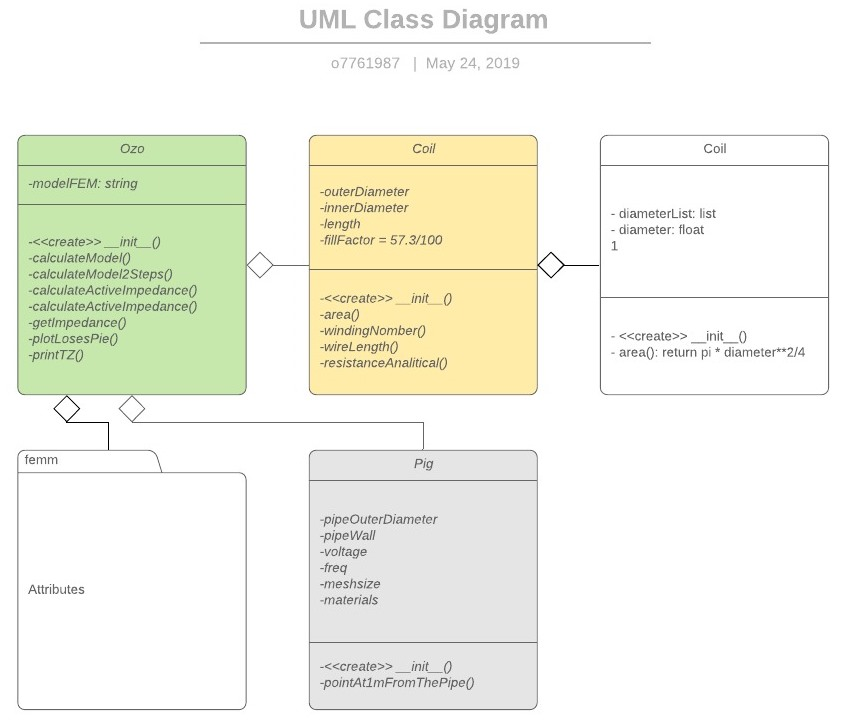
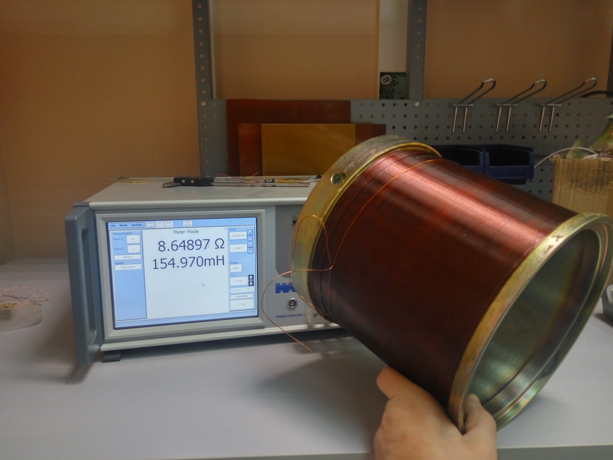
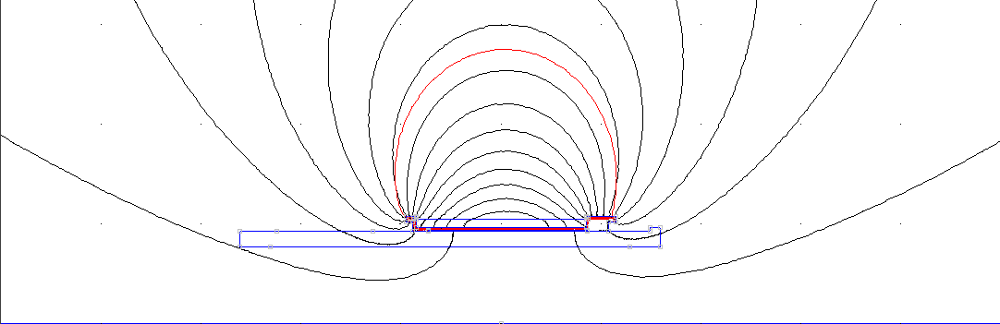

# Electromagnetic finite element analysis in python with the femm module

## 1. Goal for the project
- выбор оптимальных параметров катушек оповещателей для устаноки на внутритрубные дефектоскопы трубопроводов диаметром: 219 мм, 273 мм, 325 мм, 377 мм, 426 мм, 500 мм, 700 мм.


## 2. Details about contribution for the project

- проектирование и разработка библиотеки классов для моделирования катушек оповещателей в составе внутритрубных дефектоскопов
- тестирование методов классов на соответстие аналитическим методам решения
- эмпирическая проверка численных моделей (методов класса оповещателей)
- Метод определения электромагнитных свойств сердечника катушки
- разработка критериев эффективности: напряжённомсть магнитного поля, мощность активных потерь
- параметрических расчёт оповещателей и выбор оптимальных параметров.

---

- design and development of a class library for modeling sounder coils as part of in-line flaw detectors
- testing of class methods for compliance with analytical methods of solution
- empirical verification of numerical models (sounder class methods)
- Method for determining the electromagnetic properties of a coil core
- building of performance criteria: magnetic field strength, active power loss
- parametric calculation and obtaining optimal parameters.

## 3. An overview of the project


## Проектирование классов

###
```python
# coding=utf-8
import femm
from math import pi, sqrt, exp

# Диаметр провода выбирается из ряда diameterList
diameterList = [0.063, 0.071, 0.08, 0.09, 0.1, 0.112, 0.12, 0.125, 0.13, 0.14, 0.15, 0.16, 0.17, 0.18, 0.19, 0.2, 0.21,
                0.224, 0.236, 0.25, 0.265, 0.28, 0.3, 0.315, 0.335, 0.355, 0.38, 0.4, 0.425, 0.475, 0.45, 0.5, 0.53,
                0.56, 0.6, 0.63, 0.67, 0.69, 0.71, 0.75, 0.77, 0.8, 0.83, 0.85, 0.9, 0.93, 0.95, 1, 1.06, 1.12, 1.08,
                1.18, 1.25, 1.32, 1.4, 1.45, 1.5, 1.56, 1.6, 1.7, 1.8, 1.9, 2, 2.12, 2.24, 2.36, 2.44, 2.5]
```
### class Wire
```python
class Wire(object):
    '''
    Создание объекта Провод
    '''

    version = '0.1'  # class variable

    def __init__(self, diameter):
        '''
        Initialize Wire Diameter in meters
        '''
        self.diameter = diameter

    def area(self):
        '''
        Calculate wire Cross-sectional Area
        '''
        return pi * self.diameter ** 2 / 4
```
### class Coil 
```python
class Coil(object):
    def __init__(self, outerDiameter, innerDiameter, length, wireDiameter, fillFactor=57.3 / 100):
        '''
        Objects Inicialisation for Wire and Coil
        '''
        self.outerDiameter = outerDiameter
        self.innerDiameter = innerDiameter
        self.length = length
        self.fillFactor = fillFactor
        self.Wire = Wire(wireDiameter)

    def area(self):
        '''
        Calculate coil cross-section area
        '''
        return (self.outerDiameter - self.innerDiameter) / 2 * self.length

    def windingNomber(self):
        '''
        Calculate winding nomber in Coil
        '''
        return int(self.fillFactor * self.area() / self.Wire.area())

    def wireLength(self):
        '''
        Calculate wire length in Coil
        '''
        return pi * self.windingNomber() * (self.outerDiameter + self.innerDiameter) / 2

    def resistanceAnalitical(self):
        """ Аналитический расчёт сопротивления катушки """
        rho20 = 0.0172e-6  # (Ohm*mm^2)/m
        return rho20 * self.wireLength() / self.Wire.area()
```
### class PIG
```python
class PIG(object):
    def __init__(self, pipeOuterDiameter, pipeWall, modelName, voltage, freq=22, meshsize=1,
                 materials={'Сердечник': '1010 Steel', 'Дефектоскоп': '12H18N10T', 'Труба': '17G1S'}):
        '''
    Arguments:
    -------------------
    pipeOuterDiameter -- диаметр трубы в метрах
    pipeWall -- толщина стенки трубы в метрах

    Returns:
    -------------------
     pointAt1mFromThePipe() -- координата X точки измерения поля на растоянии 1м от трубы
        '''
        self.pipeOuterDiameter = pipeOuterDiameter
        self.pipeWall = pipeWall
        self.modelName = modelName
        self.voltage = voltage
        self.freq = freq
        self.meshsize = meshsize
        self.materials = materials

    def pointAt1mFromThePipe(self):
        return self.pipeOuterDiameter / 2 + 1
```
### class OZO
```python
class OZO(object):
    def __init__(self, Coil, PIG, results={}):
        '''
        здесь устанока атрибутов объекта и создание объектов Coil, PIG
        '''
        self.Coil = Coil
        self.PIG = PIG
        self.results = results

    # Solving
    def calculateModel(self, inputCurrentFund):
        #       =================== PreProcessing ===================
        femm.openfemm(1)
        femm.opendocument(self.PIG.modelName)
        modelNameTemp = self.PIG.modelName.split('.')[0] + '_temp' + '.fem'
        femm.mi_saveas(modelNameTemp)

        # (0) Установка частоты тока
        femm.mi_probdef(self.PIG.freq, 'millimeters', 'axi', 1e-8, 0, 30, 0)

        # (1) Установка тока в обмотки
        inputCurrentM = inputCurrentFund * sqrt(2)
        femm.mi_setcurrent('New Circuit', inputCurrentM)

        # (2) Изменеие диаметра провода
        femm.mi_addmaterial(f'Wire d={self.Coil.Wire.diameter * 1000:.2f} mm',
                            1, 1, 0, 0, 58, 0, 0, 0, 3, 0, 0, 1, self.Coil.Wire.diameter * 1000)

        # (3) Изменеие количества витков mi_setblockprop(’blockname’,  automesh,  meshsize,
        # ’incircuit’,  magdir,  group,  turns)
        femm.mi_seteditmode('blocks')
        femm.mi_selectgroup(1)
        femm.mi_setblockprop(f'Wire d={self.Coil.Wire.diameter * 1000:.2f} mm', 0, 0.5,
                             'New Circuit', 0, 1, self.Coil.windingNomber())

        # (4) Назначение материала для групп блоков FEM модели
        femm.mi_zoom(0, -160, 150, 160)
        groups = [2, 3, 4]
        for index, group in enumerate(groups):
            femm.mi_seteditmode('blocks')
            femm.mi_clearselected()
            femm.mi_selectgroup(group)
            femm.mi_setblockprop(list(self.PIG.materials.values())[index], 0, self.PIG.meshsize, 0, 0, group, 0)
            femm.mi_refreshview()
        ## =================== Расчёт ===================
        femm.mi_analyze(1)
        femm.closefemm()
        print(f'Предварительная модель "{modelNameTemp}" готова (f = {self.PIG.freq:.1f}Hz)')
        return modelNameTemp

    def CalculateModel2Steps(self, plotPie=0):
        # ============== <1-й прогон> ==============
        print(
            f'''<<<  1st step  ({self.Coil.Wire.diameter * 1000:.3f} mm) x {self.Coil.windingNomber()} витков, Сопротивление обмотки аналитически = {self.Coil.resistanceAnalitical():.3} Ом>>>
        Материалы = {self.PIG.materials}''')
        # Solve()
        tempModelName = self.calculateModel(inputCurrentFund=self.PIG.voltage / self.Coil.resistanceAnalitical())

        # Post Processing
        # tempModelName = "OZO-500_Full_temp.fem"
        (coilFieldIntensityAt1m, coilInductatce, activeImpedanceNames, activeImpedance, activePowerLoss,
         coilVoltageDrop) = self.getImpedance(modelNameTemp=tempModelName)

        # ============== <2-й прогон> ==============
        # Задание режима по вычисленому импедансу
        fullImpedance = abs(sum(activeImpedance) + 1j * 2 * pi * self.PIG.freq * coilInductatce)
        Im = self.PIG.voltage / fullImpedance
        Ifund = Im / sqrt(2)
        nominalCurrent = Ifund
        print(
            f'<<<  2nd step  ({self.Coil.Wire.diameter * 1000:.3f} mm) x {self.Coil.windingNomber()} витков, nominalCurrent = {nominalCurrent:.3f} А  >>>')
        # Solve()
        tempModelName = self.calculateModel(nominalCurrent)
        # Post Processing
        (coilFieldIntensityAt1m, coilInductatce, activeImpedanceNames, activeImpedance, activePowerLoss,
         coilVoltageDrop) = self.getImpedance(modelNameTemp=tempModelName)
        if plotPie == 1:
            self.PlotLosesPie(activeImpedanceNames, activePowerLoss)
        return [coilFieldIntensityAt1m, coilInductatce, activeImpedanceNames, activeImpedance, activePowerLoss,
                coilVoltageDrop, nominalCurrent]

    # PostProcessing
    def calculateInductance(self, group):
        '''вычисление индуктивности через A · J
        '''
        from math import pi, sqrt
        inputCurrentM = femm.mo_getcircuitproperties('New Circuit')[0]
        currentFund = inputCurrentM / sqrt(2)
        femm.mo_groupselectblock(group)
        inductance = femm.mo_blockintegral(0) / inputCurrentM ** 2  # A·J
        femm.mo_clearblock()
        return inductance.real

    def calculateActiveImpedance(self, group):
        '''
        Функция возращает значение активного импеданса (R) и мощности потерь (TotalLoses)
        R, TotalLosses = calculateActiveImpedance(currentFund)
        '''
        from math import pi, sqrt
        inputCurrentM = femm.mo_getcircuitproperties('New Circuit')[0]
        currentFund = inputCurrentM / sqrt(2)
        femm.mo_groupselectblock(group)
        TotalLosses = femm.mo_blockintegral(6)  # Total losses
        femm.mo_clearblock()
        return abs(TotalLosses / currentFund ** 2), abs(TotalLosses)

    def getImpedance(self, modelNameTemp):
        #         from math import pi, sqrt
        femm.openfemm(1)
        femm.opendocument(modelNameTemp)
        # Get CoilCerrentM from model
        femm.mi_loadsolution()

        # Расчёт напряжённости магнитного поля на расстоянии 1 м от трубы
        #         PipeDiameter = float(modelNameTemp.split('-')[1].split('_')[0])
        (Hr, Hz) = femm.mo_getpointvalues(self.PIG.pointAt1mFromThePipe() * 1000, 0)[5:7]
        coilFieldIntensityAt1m = abs(Hz)  # раньше было abs(Hr + Hz)
        # Получение амплитуды магнитного поля в катушке для последующего расчёта компонет импеданса
        inputCurrentM = femm.mo_getcircuitproperties('New Circuit')[0]
        currentFund = inputCurrentM / sqrt(2)
        activeImpedanceNames = ['Обмотка', 'Сердечник', 'Дефектоскоп', 'Труба']
        (activeImpedance, activePowerLoss) = ([], [])
        for group in range(4):
            #             print('group_{}. '.format(group))
            (activeImpedance_, activePowerLoss_) = self.calculateActiveImpedance(group + 1)  # calculateActiveImpedance
            activeImpedance.append(activeImpedance_)
            activePowerLoss.append(activePowerLoss_)
            #             print('{}: activeImpedance = {:.3f} Ohm, activePowerLoss = {:.3f} W'.format(activeImpedanceNames[group],
            #                                                                                       activeImpedance_,
            #                                                                                       activePowerLoss_))
            if group == 0:
                coilInductatce = self.calculateInductance(group + 1)
        #                 print('coilInductatce = {:.1f} mH'.format(coilInductatce * 1000))
        coilVoltageDrop = femm.mo_getcircuitproperties('New Circuit')[1]
        #         print('voltage Drop = {}'.format(abs(coilVoltageDrop)))
        print(f'''=======================================================================
        Напряжённость поля на расстоянии 1 м от трубы = {coilFieldIntensityAt1m:.2e} А/м''')
        # print(f'''Индуктивность = {coilInductatce*1000:c4} мГн, Суммарный активный импеданс = {sum(activeImpedance):.3} Ом
        # Суммарные активные потери = {sum(activePowerLoss):.3} Вт
        # Падение напряжения на катушке = {abs(coilVoltageDrop):.3} В (ампл) {abs(coilVoltageDrop)/sqrt(2):.3} В (fund)
        # ''')
        femm.closefemm()
        return coilFieldIntensityAt1m, coilInductatce, \
               activeImpedanceNames, activeImpedance, activePowerLoss, coilVoltageDrop

    def PlotLosesPie(self, labels, loses):
        '''
        Arguments:
        -------------------
        labels -- if !=0 prints names of Coils, Pigs and Ozos to be initialised
        loses

        Returns:
        -------------------

        '''
        import matplotlib.pyplot as plt
        # Pie chart, where the slices will be ordered and plotted counter-clockwise:
        data = [abs(loses) for loses in loses]
        OveralLoses = abs(sum(data))
        sizes = [val / OveralLoses for val in data]
        explode = (0, 0.1, 0, 0)  # only "explode" the 2nd slice (i.e. 'Hogs')

        fig1, ax1 = plt.subplots()  # figsize=(12, 9)
        ax1.pie(sizes, explode=explode, labels=labels, autopct='%1.1f%%', shadow=True, startangle=90)
        ax1.axis('equal')  # Equal aspect ratio ensures that pie is drawn as a circle.
        ax1.set_title("Суммарные активные потери = {:.3f} Вт".format(OveralLoses))
        plt.show()
```

## Resistance and Inductance as a function of frequnecy. Сalculation and measurement




## Method for determining the electromagnetic properties of a coil core
